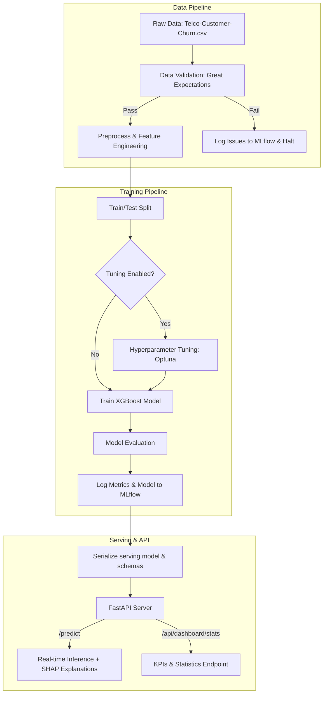

# 📊 Telco Customer Churn Machine Learning Platform

An end-to-end, production-grade Machine Learning platform designed to predict customer churn in the telecommunications sector. This repository implements a robust training and inference ecosystem leveraging **XGBoost**, **Optuna** for hyperparameter tuning, **Great Expectations** for automated data quality assurance, **MLflow** for experiment tracking and registry, and **FastAPI** for low-latency model serving with **SHAP** explanation capabilities.



---

## 🚀 Key Features

*   **Automated Data Validation:** Integrates Great Expectations to enforce data type constraints, valid business sets, numeric ranges (e.g. non-negative tenure, valid monthly charges), and logical relationships (e.g. `TotalCharges >= MonthlyCharges`) before training, preventing data skew and silent failures.
*   **Hyperparameter Optimization:** Integrates Optuna to maximize the model's recall score, ensuring the platform successfully flags customers at high risk of churn under class-imbalanced conditions.
*   **Experiment Tracking:** Logs training hyperparameters, performance metrics (F1, Precision, Recall, ROC-AUC), validation reports, and model artifacts directly into MLflow.
*   **Training-Serving Feature Consistency:** Uses a unified preprocessing module (`prepare_modeling_data`) and metadata checkpoints (`feature_columns.json` / `preprocessing.pkl`) to guarantee that the inference input undergoes the exact same feature engineering transformations as the training dataset.
*   **Explainable Predictions:** Integrates SHAP (SHapley Additive exPlanations) directly into the FastAPI response payload, providing real-time feature attribution values to show *why* a customer is predicted to churn.
*   **Rich Analytics Dashboard Endpoint:** Exposes analytical aggregation endpoints detailing churn rates by contract types, demographics, tenure cohorts, payment methods, and charges distribution.

---

## 📂 Directory Structure

```text
Telco-Customer-Churn-ML-main/
├── .github/                  # CI/CD configurations
├── artifacts/                # Local serialized training metadata (feature columns, schemas)
├── data/
│   ├── raw/                  # Original raw dataset
│   └── processed/            # Cleaned, engineered, and partitioned train/test CSVs
├── notebooks/
│   └── EDA.ipynb             # Exploratory Data Analysis Jupyter Notebook
├── scripts/
│   ├── prepare_processed_data.py   # Executable pipeline stage for data prep
│   ├── run_pipeline.py             # Orchestrates loading, validation, training, tuning, and logging
│   ├── test_dashboard_api.py       # Integration tests for dashboard statistics API
│   ├── test_fastapi.py             # Server integration tests simulating client prediction calls
│   ├── test_inference.py           # Unit tests validating inference pipeline + SHAP integrity
│   ├── test_pipeline_modeling.py   # Quick standalone tuning and training script
│   └── test_pipeline_preprocessing_data.py # Validates preprocessing pipelines locally
├── src/
│   ├── app/
│   │   ├── main.py           # FastAPI Application (Endpoints, Dashboard logic, Pydantic Schema)
│   │   └── app.py            # Simple fallback FastAPI Application for raw endpoint test
│   ├── data/
│   │   ├── load_data.py      # Core data loaders
│   │   └── preprocess.py     # Main Preprocessing and Feature Engineering pipeline
│   ├── models/
│   │   ├── evaluate.py       # Evaluation metrics and printing utilities
│   │   ├── train.py          # XGBoost training orchestration
│   │   └── tune.py           # Optuna optimization functions
│   ├── serving/
│   │   ├── inference.py      # Serving-time preprocessing, model loaders, and SHAP calculators
│   │   └── model/            # Target directory for serialized local model binaries
│   └── utils/
│       ├── utils.py          # Universal helper utilities
│       └── validate_data.py  # Great Expectations validation suite schema
├── dockerfile                # Docker image specification for cloud deployment
├── requirements.txt          # Python package dependencies
└── README.md                 # Project Documentation
```

---

## 🛠️ Setup & Installation

### Prerequisites
*   Python 3.11+
*   Git

### 1. Clone & Navigate
```bash
git clone <repository_url>
cd Telco-Customer-Churn-ML-main
```

### 2. Configure Virtual Environment
Create a clean virtual environment and install the package requirements:
```bash
# Create virtual environment
python -m venv .venv

# Activate on Windows (cmd/powershell)
.venv\Scripts\activate

# Install dependencies
pip install --upgrade pip
pip install -r requirements.txt
```

---

## 🏃 Running the Workflow

The system is split into two primary pipelines: **Model Lifecycle (Training)** and **Model Serving (API/Inference)**.

### A. Run Model Training & Tuning Pipeline
To run the end-to-end pipeline (Data Loading ➡️ Validation ➡️ Preprocessing ➡️ Tuning ➡️ Training ➡️ Evaluation ➡️ MLflow Logging):

```bash
# Run basic training (uses default hyperparameters)
python scripts/run_pipeline.py --input data/raw/Telco-Customer-Churn.csv

# Run with Optuna Hyperparameter Tuning enabled
python scripts/run_pipeline.py --input data/raw/Telco-Customer-Churn.csv --tune --trials 30 --threshold 0.35
```

#### CLI Arguments for `run_pipeline.py`:
*   `--input` *(str, required)*: Path to the raw CSV dataset.
*   `--target` *(str, default: "Churn")*: Target column name.
*   `--threshold` *(float, default: 0.35)*: Probability decision threshold.
*   `--test_size` *(float, default: 0.2)*: Split percentage for the test cohort.
*   `--tune` *(flag)*: Enable Optuna tuning.
*   `--trials` *(int, default: 30)*: Optuna optimization iterations.
*   `--mlflow_uri` *(str)*: Optional tracking URI override. Defaults to local `./mlruns` directory.

### B. View Training Logs (MLflow Dashboard)
Launch the MLflow user interface to view parameters, curves, and validation artifacts:
```bash
mlflow ui
```
*Open [http://127.0.0.1:5000](http://127.0.0.1:5000) in your browser.*

---

## 🖥️ Deploying Model Serving (API)

### 1. Launch FastAPI Server
Run the API web server using Uvicorn:
```bash
python -m uvicorn src.app.main:app --host 127.0.0.1 --port 8000 --reload
```
*Docs will be available locally at [http://127.0.0.1:8000/docs](http://127.0.0.1:8000/docs)*

### 2. Execute Integration & Unit Tests
While the server is running, you can launch various verification tests:
```bash
# Test inference pipeline logic + SHAP functionality
python scripts/test_inference.py

# Test API prediction endpoints
python scripts/test_fastapi.py

# Test Dashboard stats calculation endpoints
python scripts/test_dashboard_api.py
```

---

## 🐳 Containerization & Docker Deployment

Deploying the system in an isolated container ensures reproducible behavior across staging and production.

### 1. Build Docker Image
```bash
docker build -t telco-churn-api .
```

### 2. Run Container
```bash
docker run -p 8000:8000 telco-churn-api
```
The endpoint is now exposed on port `8000`. You can perform predictions by querying `http://localhost:8000/predict`.

---

## 🔒 API Key Authentication & Management

To secure production deployments, access to the prediction and dashboard statistics endpoints requires a valid API key.

### Configuration Settings
You can customize the authorization layer using environment variables (or by placing them in a `.env` file at the project root):
- `ENABLE_API_KEY_AUTH`: Enable/disable authentication check (boolean: `true`/`false`, default: `true`).
- `ADMIN_API_KEY`: Sets a custom Master Admin Key. If not set, a persistent random admin key will be auto-generated inside `data/api_keys.json`.
- `API_KEYS_FILE_PATH`: Set custom path for the database storage of client API keys (default: `data/api_keys.json`).

### Authorization Headers
Clients must supply the API key in requests using one of the following formats:
- **Header:** `X-API-Key: YOUR_API_KEY`
- **Bearer Token:** `Authorization: Bearer YOUR_API_KEY`

### Administrative Key Management Endpoints
Admin endpoints require verification against the master admin key.

#### 1. List Keys
- **URL:** `GET /api/admin/keys`
- **Description:** Retrieve all registered API keys and metadata (owners, statuses, created dates).

#### 2. Create Key
- **URL:** `POST /api/admin/keys`
- **Description:** Register a new client key. If the `key` field is omitted, a random secure token is generated automatically.
- **Request Body:**
  ```json
  {
    "owner": "Client Name",
    "key": "optional_custom_key_string",
    "is_active": true
  }
  ```

#### 3. Update Key
- **URL:** `PATCH /api/admin/keys/{key_value}`
- **Description:** Modify owner details or toggle the active status of a key.
- **Request Body:**
  ```json
  {
    "owner": "New Client Name",
    "is_active": false
  }
  ```

#### 4. Revoke Key
- **URL:** `DELETE /api/admin/keys/{key_value}`
- **Description:** Permanently delete/revoke an API key.

---

## 🔌 API Endpoints Documentation

### 1. Health Check
*   **URL:** `GET /`
*   **Description:** Connectivity health-check endpoint.
*   **Response:**
    ```json
    {
      "status": "ok"
    }
    ```

### 2. Predict Churn
*   **URL:** `POST /predict`
*   **Access:** Protected (Requires `X-API-Key` or Bearer Token)
*   **Description:** Returns churn prediction binary statement and feature attribution values (SHAP).
*   **Request Schema (`CustomerData`):**
    ```json
    {
      "Gender": "Male",
      "SeniorCitizen": 0,
      "Partner": "Yes",
      "Dependents": "No",
      "Tenure": 12,
      "PhoneService": "Yes",
      "MultipleLines": "No",
      "InternetService": "Fiber optic",
      "OnlineSecurity": "No",
      "OnlineBackup": "Yes",
      "DeviceProtection": "No",
      "TechSupport": "No",
      "StreamingTV": "Yes",
      "StreamingMovies": "Yes",
      "Contract": "Month-to-month",
      "PaperlessBilling": "Yes",
      "PaymentMethod": "Electronic check",
      "MonthlyCharges": 85.00,
      "TotalCharges": 1020.00
    }
    ```
*   **Response Schema:**
    ```json
    {
      "prediction": "Likely to churn",
      "shap_values": {
        "Tenure": -0.8543,
        "MonthlyCharges": 0.2541,
        "Contract_Two year": -1.2144,
        "InternetService_Fiber optic": 0.9852,
        "...": 0.0
      }
    }
    ```

### 3. Dashboard Statistics
*   **URL:** `GET /api/dashboard/stats`
*   **Access:** Protected (Requires `X-API-Key` or Bearer Token)
*   **Description:** Serves comprehensive demographic and subscription metrics for analytical dashboards.
*   **Response Schema (Truncated Sample):**
    ```json
    {
      "summary": {
        "total_customers": 7043,
        "churn_rate": 26.54,
        "total_churned": 1869,
        "total_retained": 5174,
        "total_monthly_charges": 456116.6,
        "average_monthly_charges": 64.76,
        "average_tenure": 32.37
      },
      "churn_by_contract": {
        "Month-to-month": { "churned": 1655, "retained": 2220, "rate": 42.71 },
        "One year": { "churned": 166, "retained": 1307, "rate": 11.27 },
        "Two year": { "churned": 48, "retained": 1647, "rate": 2.83 }
      },
      "demographics": {
        "gender": {
          "Female": { "churned": 939, "retained": 2549, "rate": 26.92 },
          "Male": { "churned": 930, "retained": 2625, "rate": 26.16 }
        }
      }
    }
    ```

---

## 📊 Methodology & Modeling Decisions

1.  **Handling Class Imbalance:** The Telco dataset exhibits a high churn imbalance (~26.5% churn). To counter this, the XGBoost `scale_pos_weight` hyperparameter is dynamically configured in training as:
    $$\text{scale\_pos\_weight} = \frac{N_{\text{majority class}}}{N_{\text{minority class}}}$$
2.  **Optimizing for Recall:** High recall ensures that the business intercepts the maximum number of potential churners. Optuna is utilized to tune model parameters to maximize this target metric.
3.  **Low-Latency Explanation:** Calculating SHAP attributions using tree-based algorithms is fast, enabling explainable ML features in real-time customer support tools.
